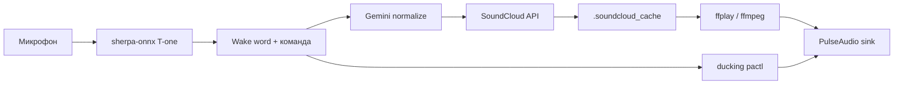

# Smart Speaker

Голосовой музыкальный ассистент для Linux: распознаёт речь на русском, ищет треки на SoundCloud и управляет воспроизведением через микрофон.

Пример: **«Алёша, включи Linkin Park In The End»** → поиск → воспроизведение через `ffplay`.

## Возможности

- **Wake word** — активация по имени («Алёша», «Алёша», «Алексей»; настраивается)
- **Поиск и воспроизведение** — SoundCloud API + `ffplay` / `ffmpeg`
- **Управление плеером** — стоп, продолжить, следующий/предыдущий трек
- **Громкость** — «сделай громче», «поставь громкость на 50»
- **Ducking** — при wake word музыка приглушается (PulseAudio / PipeWire через `pactl`)
- **Нормализация запросов** — Gemini переводит транслит («линкин парк ин зе енд» → «Linkin Park In The End»); опционально
- **Локальный кэш MP3** — LRU-кэш по track id для быстрого «продолжи» и seek

## Требования

| Компонент | Назначение |
|-----------|------------|
| **Linux** | PulseAudio или PipeWire (`pactl`) |
| **Python 3.10+** | основной код |
| **ffmpeg, ffplay** | воспроизведение и seek по HTTP/HLS |
| **Микрофон** | `sounddevice` / PortAudio |
| **wget** | скачивание STT-модели |

```bash
# Ubuntu / Debian
sudo apt install ffmpeg wget pulseaudio-utils  # или pipewire-pulse + wireplumber
```

## Быстрый старт

```bash
git clone <url-репозитория> smart_speaker
cd smart_speaker

python3 -m venv .venv
source .venv/bin/activate
pip install -r requirements.txt

# STT-модель (~138 MB)
./scripts/download_models.sh

# Секреты SoundCloud и опционально Gemini
cp .env.example .env
# отредактируйте .env

python voice_music_assistant.py
```

## Настройка `.env`

Скопируйте `.env.example` → `.env`. Файл `.env` в git не попадает.

| Переменная | Обязательно | Описание |
|------------|-------------|----------|
| `SOUNDCLOUD_OAUTH_TOKEN` | да | OAuth-токен из браузера (без префикса `OAuth `) |
| `SOUNDCLOUD_CLIENT_ID` | да | `client_id` из запросов к `api-v2.soundcloud.com` |
| `SOUNDCLOUD_USER_ID` | да | `user_id` из параметров search |
| `SOUNDCLOUD_SC_A_ID` | да | `sc_a_id` из параметров search |
| `GEMINI_API_KEY` | нет | Ключ Google AI; без него поиск идёт по сырому тексту STT |
| `SOUNDCLOUD_APP_VERSION` | нет | Версия клиента SoundCloud (есть дефолт) |
| `SOUNDCLOUD_APP_LOCALE` | нет | Локаль API (по умолчанию `en`) |

### Как получить токены SoundCloud

1. Откройте [soundcloud.com](https://soundcloud.com/) в браузере, войдите в аккаунт.
2. DevTools → **Network** → фильтр `api-v2`.
3. Выполните поиск трека на сайте.
4. Из запроса к `/search` или `/tracks` скопируйте:
   - заголовок **Authorization** → значение после `OAuth ` → `SOUNDCLOUD_OAUTH_TOKEN`
   - query-параметры `client_id`, `user_id`, `sc_a_id`

Токены привязаны к аккаунту и со временем могут протухнуть — тогда обновите `.env`.

## Голосовые команды

Wake word в начале фразы: **«Алёша, …»**

| Команда | Примеры |
|---------|---------|
| Включить трек | «включи песню Metallica», «поставь Linkin Park» |
| Стоп / пауза | «стоп», «пауза», «выключи музыку» |
| Продолжить | «продолжи», «играй дальше» |
| Следующий | «следующий трек», «дальше» |
| Предыдущий | «предыдущий трек», «назад» |
| Громкость | «сделай громче», «поставь громкость на тридцать» |

Паттерны команд настраиваются в [`voice_commands.json`](voice_commands.json) (regex). Имена ассистента — поле `assistant_names`.

## Архитектура



- **Аудио-колбэк** (`sounddevice`) — только STT и детекция wake word.
- **Главный поток** — ducking, стабильность текста, выполнение команд.
- **Фоновые потоки** — позиция воспроизведения, автопереход на следующий трек.

## Структура проекта

```
smart_speaker/
├── voice_music_assistant.py   # точка входа
├── settings.py                # конфигурация
├── voice_commands.json        # regex команд и wake words
├── .env.example               # шаблон секретов
├── scripts/
│   └── download_models.sh     # скачивание STT-модели
├── models/
│   └── sherpa-onnx-t-one-ru/  # model.onnx + tokens.txt (не в git)
├── core/                      # состояние ассистента, утилиты текста
├── services/
│   ├── voice/                 # STT, ассистент, команды
│   ├── soundcloud/            # API-клиент, LRU-кэш треков
│   ├── audio/                 # ducking, громкость
│   └── ai/                    # нормализация запросов (Gemini)
└── assests/activate.wav       # звук «ассистент слушает»
```

## Модели

В git **не** хранятся бинарники (`.onnx` > 100 MB не пройдут на GitHub).

Используется одна модель:

- **T-one Russian** — streaming CTC, ~138 MB  
  Источник: [k2-fsa/sherpa-onnx releases](https://github.com/k2-fsa/sherpa-onnx/releases/tag/asr-models)

```bash
./scripts/download_models.sh
```

Подробнее: [`models/README.md`](models/README.md).

## Конфигурация в `settings.py`

Основные параметры (без секретов):

| Параметр | По умолчанию | Смысл |
|----------|--------------|-------|
| `SOUNDCLOUD_CACHE_MAX_BYTES` | 500 MB | LRU-кэш MP3; `0` — только стрим |
| `DUCK_VOLUME_PERCENT` | 60 | громкость музыки при wake word (% от базы) |
| `RESUME_REWIND_SECONDS` | 5 | откат при «продолжи» |
| `TEXT_STABLE_TIMEOUT` | 3.0 с | пауза в речи → команда готова |
| `STT_MODEL_PATH` | `models/sherpa-onnx-t-one-ru` | путь к STT |

Базовая громкость `ffplay` хранится в `.speaker_volume.json` (локально, не в git).

## Что не коммитится

| Путь | Причина |
|------|---------|
| `.env` | OAuth, API-ключи |
| `models/**/*.onnx` | большие бинарники |
| `.soundcloud_cache/` | скачанные треки |
| `.speaker_volume.json` | локальная громкость |
| `debug_data/` | дампы API с JWT |

## Разработка

```bash
# Только нормализация запросов (нужен GEMINI_API_KEY)
python test.py

# Поиск и воспроизведение без голоса
python -m services.soundcloud.client "metallica"
```

Зависимости: [`requirements.txt`](requirements.txt).

## Лицензии сторонних компонентов

- **T-one** — см. [`models/sherpa-onnx-t-one-ru/LICENSE`](models/sherpa-onnx-t-one-ru/LICENSE) после скачивания модели
- **SoundCloud** — неофициальный доступ через web API; только для личного использования
- **Gemini** — [Google AI Terms](https://ai.google.dev/terms)

## Ограничения

- Работает на **Linux** с PulseAudio/PipeWire; macOS/Windows не поддерживаются.
- SoundCloud может отдавать HLS — такие треки не кэшируются как один `.mp3`, воспроизведение идёт по URL.
- Качество распознавания зависит от микрофона и фонового шума; T-one оптимизирован под телефонию, но работает и с обычным микрофоном.
